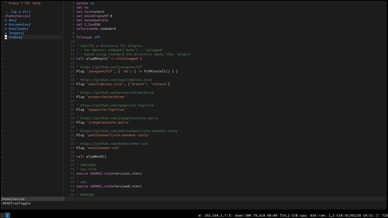

## Wat?! vim?
Yup, this is a script to make vim with visual and minimal functions like vscode...

## Ok, but some more?
1. Yup, added code complete for python, html and css.
1. Added good identation for html, and auto close bracket for supported files.
1. File navigation with NerdTree `Ctrl+t`.
1. Visual color style based on vscode dark theme (light theme its beautiful to, but...)
1. Support for linters.
1. Support for virtualenvs.

## Yup, but how i put this to work?
do it!!!

```
chmod +x bumblevim.sh
./bumblevim.sh
```

wait the script end... ~~There's no message at the end yet~~ the **"[!] install complete"** message will be showed... or just wait the terminal act normal again.

If all work... when you open, vim will be with a new visual.

All plugins used on that vim config, stay on .vimrc with each github page reference.

But i deicide to show them here... they are awesome... it's used vim-plug to manage vim's addons

## Help

For instalation and update vim packages and venvs see...
```
./bumblevim.sh --help
```

If you have problems with node... i forgot to say.. you must install minimal nodejs and npm on your system, coc-nvim uses node for code complete.

Fedora:
```
dnf install nodejs
```

Ubuntu:
```
apt install nodejs npm --no-install-recomments
```

Archlinux:
```
pacman -S nodejs npm
```


Help it made you love vim!

if you curious but don't wanna try... look...


